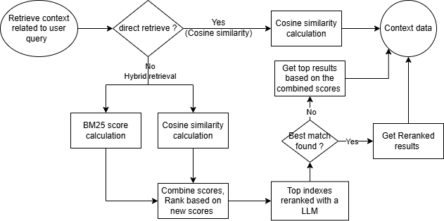

# PIGenerator

This project uses a Language Model (LLM) to generate Pipe and Instrumentation Diagrams (P&ID) based on user input. The workflow involves retrieving relevant details, generating prompts, and handling retries for errors.
Following diagram shows how this PI diagram generation process works with LLM.

The project also includes a Retrieval-Augmented Generation (RAG) process to enhance the context data retrieval for generating P&ID diagrams. The RAG process involves using a vector database to retrieve relevant context data based on user input, which is then used to generate more accurate and relevant P&ID diagrams. To improve the accuracy and modify the specs can add more data to resource folder (src/rag_system/resources).

